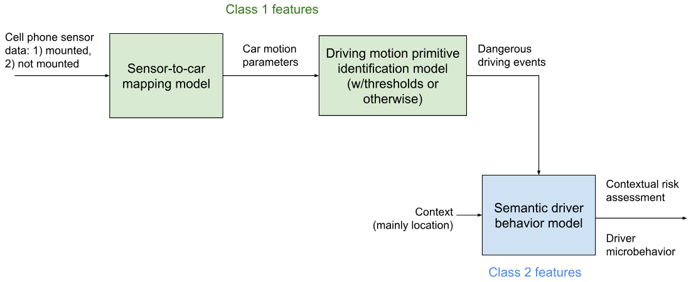
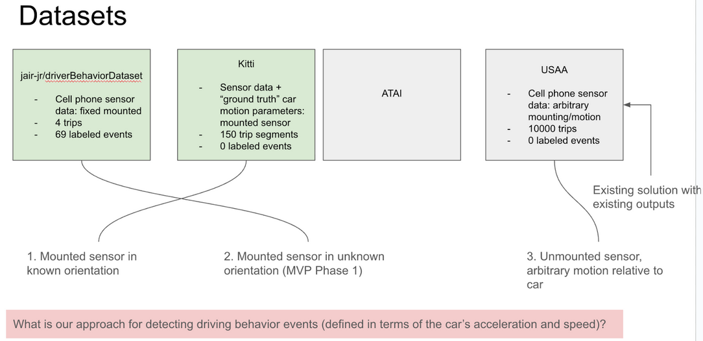

# Driving Behavior Analysis

This repository contains datasets and scripts for analyzing driving behavior using smartphone sensor data. The project focuses on mapping sensor measurements to vehicle dynamics and identifying dangerous driving primitives for risk assessment.

## Project Overview

The goal of this project is to develop robust methods for analyzing driving behavior using smartphone sensors (accelerometer, gyroscope, magnetometer) and contextual information. The project is structured in multiple stages, progressing from mounted sensor analysis to advanced AI-based risk assessment.



The pipeline above illustrates the two main components:
- **Class 1 Features**: Transform cell phone sensor data (mounted or unmounted) through a sensor-to-car mapping model to car motion parameters, then identify dangerous driving events using driving primitive identification models
- **Class 2 Features**: Combine dangerous driving events with contextual information (mainly location) through a semantic driver behavior model to generate contextual risk assessment and driver microbehavior analysis

## Project Roadmap

### Class 1 Features: Driving Primitive Detection

#### Stage 1: Mapping Acceleration of a Mounted Sensor to Car Acceleration

The first goal is to develop a method to map the acceleration of a mounted sensor (a phone or otherwise) to the car's acceleration.

**Key objectives:**
- Develop an algorithm for estimating the mounted sensor's orientation
- Rotate the sensor's coordinate frame to align with the car's frame
- Implement processing steps such as gravity removal and post-processing
- Explore the use of Newton or other ML frameworks

**Datasets for development and validation:**
1. **KITTI Dataset**: Use car motion parameters as ground truth to evaluate mapping algorithms (initial focus on validating orientation information)
2. **JAIR-JR Dataset**: Evaluate orientation estimation through proxy tasks (e.g., ensuring consistent orientation when the car is not moving)
3. **ATAI Dataset**: Internal dataset for additional validation

**Exploration of USAA-defined thresholds:**
- Evaluate USAA-defined thresholds for driving primitive identification
- Test general applicability on behavior-based labeled datasets (JAIR, ATAI)

#### Stage 2: Mapping Acceleration of an Unmounted Sensor to Car Acceleration

Building from Stage 1 methods and algorithms, this stage extends the approach to handle unmounted sensors using the ATAI dataset for validation.

#### Stage 3: Evaluation Using the USAA Dataset

Comprehensive evaluation of the developed model on the USAA dataset.

#### Stage 4 (Optional): AI-Based Enhanced Detection

Based on evaluation results and potential generalizability limitations of USAA-defined thresholds, explore AI-based methods (using Newton or otherwise) for enhanced identification of dangerous driving primitives.

**Reference:** [Smartphone-based Hard-braking Event Detection at Scale for Road Safety Services](https://arxiv.org/abs/2106.09023)

### Class 2 Features: Contextual Risk Assessment

Leverage Newton's semantic alignment capabilities to:

**Contextual risk assessment:**
- Combine Class 1 features with additional context for contextual risk assessment
- Generate driver micro-behavior descriptors
- Examples:
  - Rapid acceleration in a highway vs. a residential neighborhood
  - Harsh braking event coinciding with phone notifications (distraction detection)

**Contextual explanation:**
- Identify situations where additional context explains Class 1 feature instances
- Example: Rapid acceleration spike caused by driving over a pothole

## Repository Structure

```
.
├── datasets/           # Driving behavior datasets
│   ├── atai/          # Internal ATAI dataset
│   │   └── data/
│   │       └── driving_data/
│   │           └── EQE_wireless_charging_port/
│   └── jair_jr/       # JAIR-JR public dataset
│       └── data/
├── scripts/           # Data processing and analysis scripts
├── media/            # Diagrams and visualizations
└── README.md         # This file
```

## Datasets



The project leverages four datasets across three development phases:
1. **Mounted sensor in known orientation**: JAIR-JR dataset (fixed mounted, 4 trips, 69 labeled events)
2. **Mounted sensor in unknown orientation (MVP Phase 1)**: KITTI dataset (sensor data + ground truth car motion parameters, 150 trip segments)
3. **Unmounted sensor, arbitrary motion relative to car**: USAA dataset (arbitrary mounting/motion, 10000 trips, unlabeled) - evaluation with existing solution

### 1. ATAI Dataset

Internal dataset collected by Archetype AI members for the USAA driving behavior analysis project.

**Location:** `datasets/atai/data/driving_data/EQE_wireless_charging_port/`

**Data collection setup:**
- Vehicle: Mercedes EQE
- Sensor mounting: Wireless charging port
- Contains multiple driving scenarios including:
  - Highway driving
  - Abrupt braking events
  - Normal driving conditions
  - Traffic scenarios

**Data format:**
- CSV files with sensor measurements (timestamp, acceleration, orientation, etc.)
- Visualization PNG files showing motion variables

### 2. JAIR-JR Dataset

Public dataset from driver behavior research, containing smartphone sensor measurements for various driving events.

**Location:** `datasets/jair_jr/data/`

**Dataset details:**
- 4 car trips (folders: 16, 17, 20, 21)
- Vehicle: 2011 Honda Civic
- Smartphone: Motorola XT1058 (Android 5.1)
- Fixed mounting on windshield
- Sampling rate: 50-200 Hz
- 69 labeled driving events across 7 categories:
  - Aggressive braking (12 samples)
  - Aggressive acceleration (12 samples)
  - Aggressive left turn (11 samples)
  - Aggressive right turn (11 samples)
  - Aggressive left lane change (4 samples)
  - Aggressive right lane change (5 samples)
  - Non-aggressive event (14 samples)

**Files per trip:**
- `aceleracaoLinear_terra.csv` - Linear acceleration (3-axis)
- `acelerometro_terra.csv` - Acceleration (3-axis)
- `campoMagnetico_terra.csv` - Magnetometer readings (3-axis)
- `giroscopio_terra.csv` - Gyroscope readings (3-axis)
- `groundTruth.csv` - Event start/end timestamps with labels
- `viagem.json` - Smartphone information

**References:**
- [Driver behavior profiling: An investigation with different smartphone sensors and machine learning](http://journals.plos.org/plosone/article?id=10.1371/journal.pone.0174959)
- [Exploiting the Use of Recurrent Neural Networks for Driver Behavior Profiling](http://ieeexplore.ieee.org/document/7966230/)

### 3. KITTI Dataset (External)

The KITTI Vision Benchmark Suite provides ground truth car motion parameters for validation.

**Usage:** Ground truth validation for orientation estimation and sensor-to-car frame mapping algorithms.

## Scripts

### Data Processing

- **`compute_velocity_acceleration.py`**: Computes velocity and acceleration from sensor data
- **`sensorFrame2CarFrame.py`**: Transforms sensor coordinate frame to car coordinate frame
- **`plot_orientation.py`**: Visualizes sensor orientation data

### Analysis and Visualization

- **`viz_data_collection_usaa.ipynb`**: Jupyter notebook for visualizing USAA data collection
- **`test_v2.py`**: Testing and validation scripts

## Getting Started

### Prerequisites

```bash
# Python 3.x required
# Install dependencies (create a requirements.txt as needed)
pip install numpy pandas matplotlib scipy
```

### Basic Usage

1. **Process sensor data:**
```bash
python scripts/compute_velocity_acceleration.py
```

2. **Transform coordinate frames:**
```bash
python scripts/sensorFrame2CarFrame.py
```

3. **Visualize data:**
```bash
jupyter notebook scripts/viz_data_collection_usaa.ipynb
```

## Contributing

This is an internal research project. For questions or contributions, please contact the project team.

## License

[Add appropriate license information]

## References

- [Conversion of phone measurements to car measurements: literature review](#)
- [Smartphone-based Hard-braking Event Detection at Scale for Road Safety Services](https://arxiv.org/abs/2106.09023)
- [JAIR-JR Dataset Papers](datasets/jair_jr/README.md)

## Contact

[Add contact information for project maintainers]
